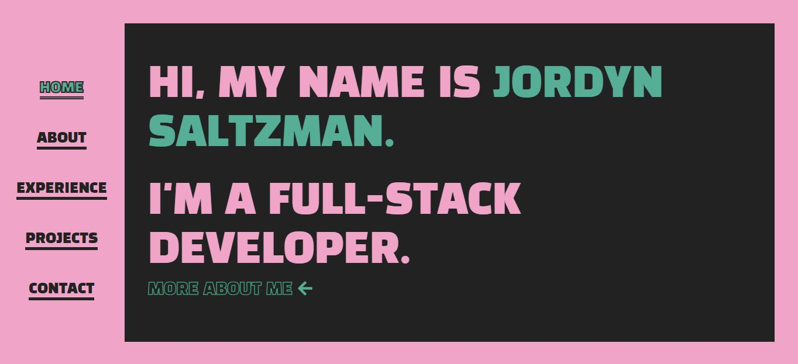
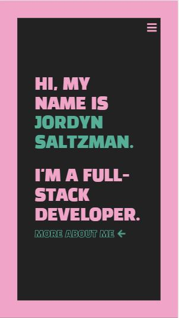

# React Portfolio

Recreating my developer portfolio using React. Work in progress.

## Preview

## Description

      For my updated portfolio, I wanted to create a minimalist design with a retro feel. I initially did all of the styling using my own CSS in order to acheive the specific layout I desired. However, I faced some issues with mobile responsiveness and eventually incorporated Bootstrap as a framework and media queries as well. I really enjoyed creating reusable components in React, and found it much more efficient than templating engines such as Handlebars used in previous projects. I also enjoyed using state and turnary operators for conditional rendering.

## Design

- Font: [Rubic Mono One](https://fonts.google.com/specimen/Rubik+Mono+One)

## Usage

Download or `git clone` this repo, and then run the following commands from the terminal:

- `npm install`
- `npm start`

## License

MIT License

Copyright (c) 2020 Jordyn Saltzman

Permission is hereby granted, free of charge, to any person obtaining a copy of this software and associated documentation files (the "Software"), to deal in the Software without restriction, including without limitation the rights to use, copy, modify, merge, publish, distribute, sublicense, and/or sell copies of the Software, and to permit persons to whom the Software is furnished to do so, subject to the following conditions: The above copyright notice and this permission notice shall be included in all copies or substantial portions of the Software. THE SOFTWARE IS PROVIDED "AS IS", WITHOUT WARRANTY OF ANY KIND, EXPRESS OR IMPLIED, INCLUDING BUT NOT LIMITED TO THE WARRANTIES OF MERCHANTABILITY, FITNESS FOR A PARTICULAR PURPOSE AND NONINFRINGEMENT. IN NO EVENT SHALL THE AUTHORS OR COPYRIGHT HOLDERS BE LIABLE FOR ANY CLAIM, DAMAGES OR OTHER LIABILITY, WHETHER IN AN ACTION OF CONTRACT, TORT OR OTHERWISE, ARISING FROM, OUT OF OR IN CONNECTION WITH THE SOFTWARE OR THE USE OR OTHER DEALINGS IN THE SOFTWARE.
